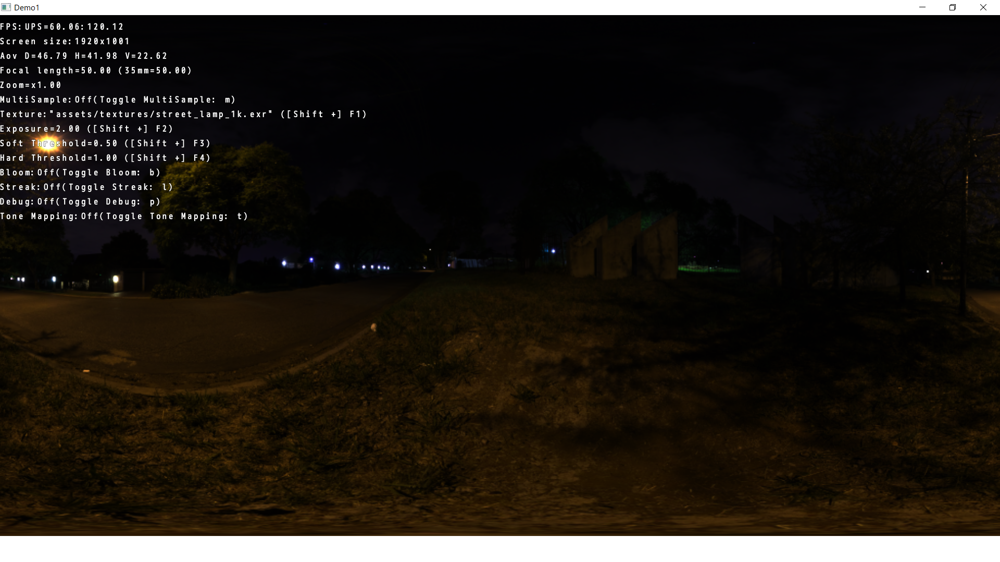
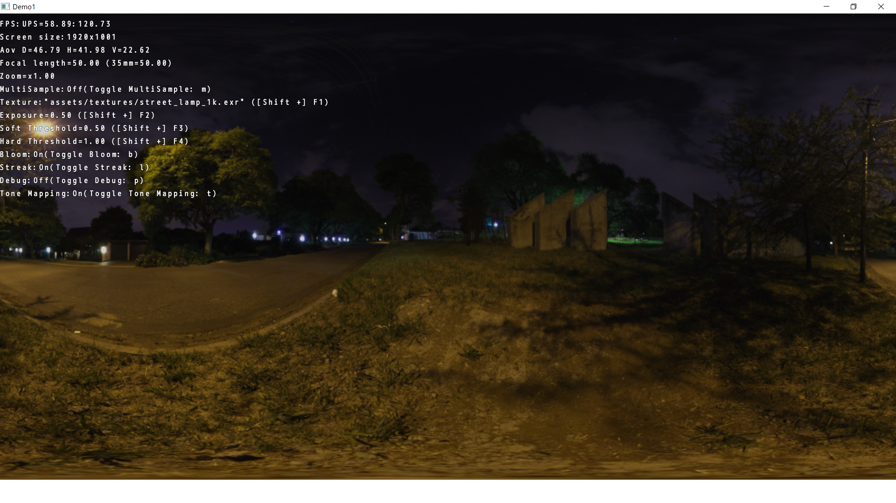
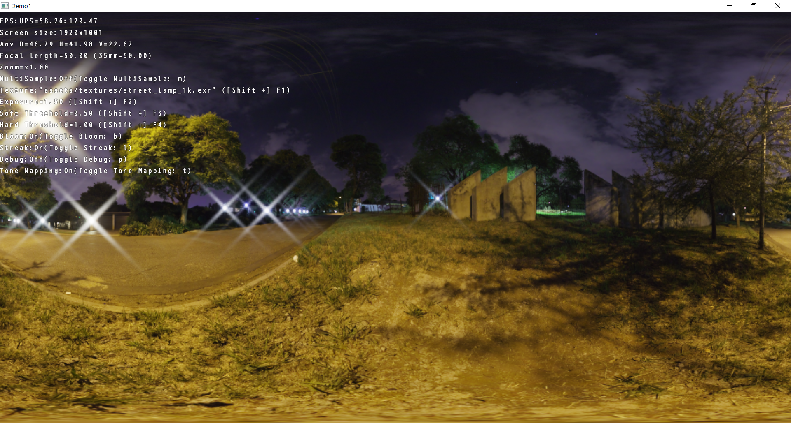

Demo1
=============================

- HDR rendering
- ACES Filmic Tone Mapping
- Kawase’s Bloom Filter
- Kawase’s Light Streak Filter

### Render HDR to LDR directly.

### Render HDR to LDR using tone mapping.

#### Exposure=0.5

#### Exposure=1.0

#### Exposure=1.5

#### Exposure=5.0

This sample is a WORK IN PROGRESS and actually not meant as a sample.

On the TODO list:
*

Run the sample for more information.

