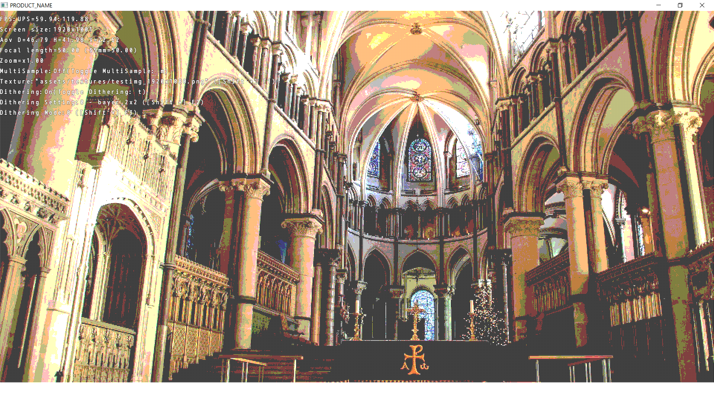
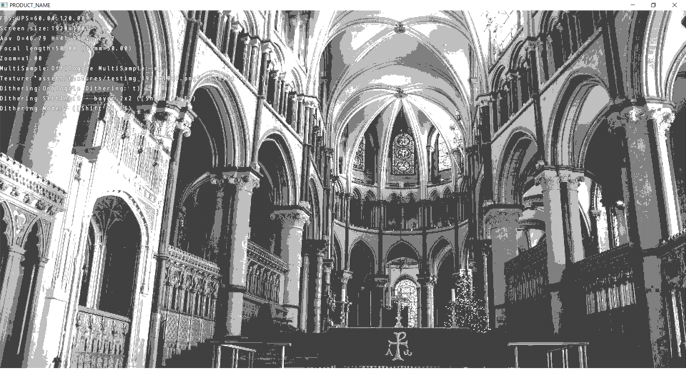
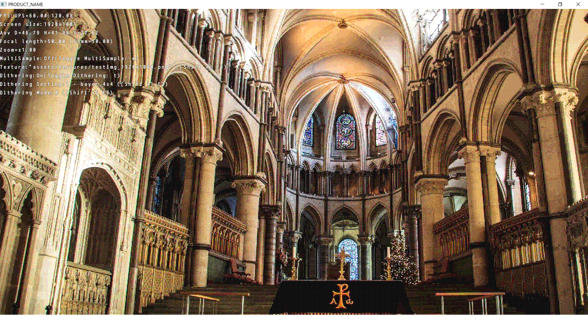
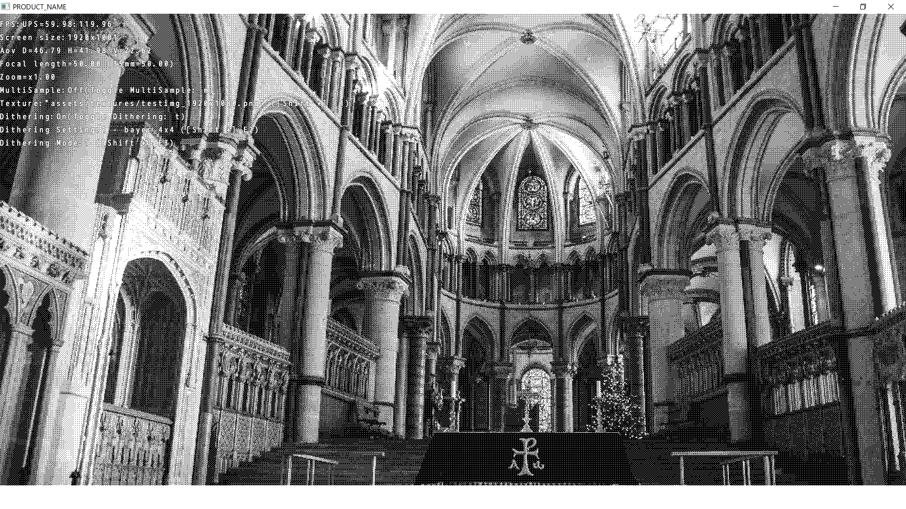

Dithering
=============================

|                color                |             monochrome              |
| :---------------------------------: | :---------------------------------: |
|  |  |
|  |  |
|  |  |

This sample is a WORK IN PROGRESS and actually not meant as a sample.

On the TODO list:
*

Run the sample for more information.

See also:

- [Ordered dithering](https://en.wikipedia.org/wiki/Ordered_dithering)

