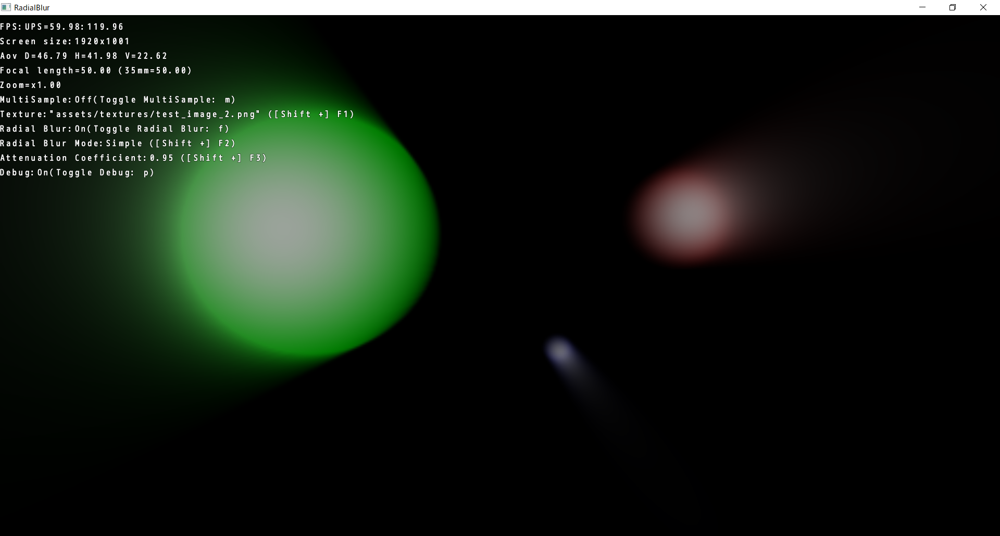
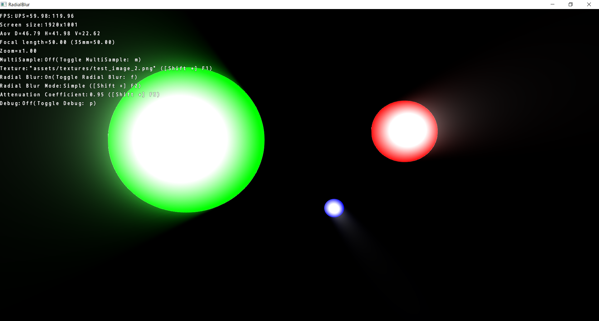

Radial Blur
=============================

|   simple 128 samples per pixel   | custom In the example, 5 pass rendering. Although 20 samples per pixel, it is logically equivalent to 1024 samples per pixel. |
| :---------------------------------: | :----------------------------------------------------------: |
|  |                           |
|  |                           |

This sample is a WORK IN PROGRESS and actually not meant as a sample.

On the TODO list:
*

Run the sample for more information.

