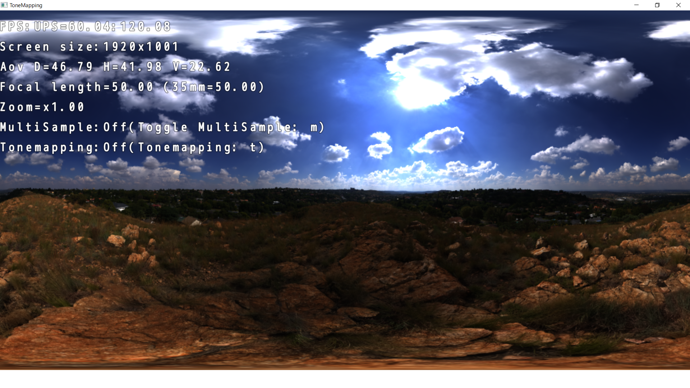

Tone Mapping
=============================

### Convert HDR to LDR directly.

### Convert HDR to LDR using tone mapping.

This sample is a WORK IN PROGRESS and actually not meant as a sample.

On the TODO list:
*

Run the sample for more information.

See also:

[ACES Filmic Tone Mapping Curve](https://knarkowicz.wordpress.com/2016/01/06/aces-filmic-tone-mapping-curve/)

[Filmic Tonemapping Operators](http://filmicworlds.com/blog/filmic-tonemapping-operators/)

[Tech Feature: HDR Lighting](https://frictionalgames.blogspot.com/2012/09/tech-feature-hdr-lightning.html)

[HDR](https://learnopengl.com/Advanced-Lighting/HDR)